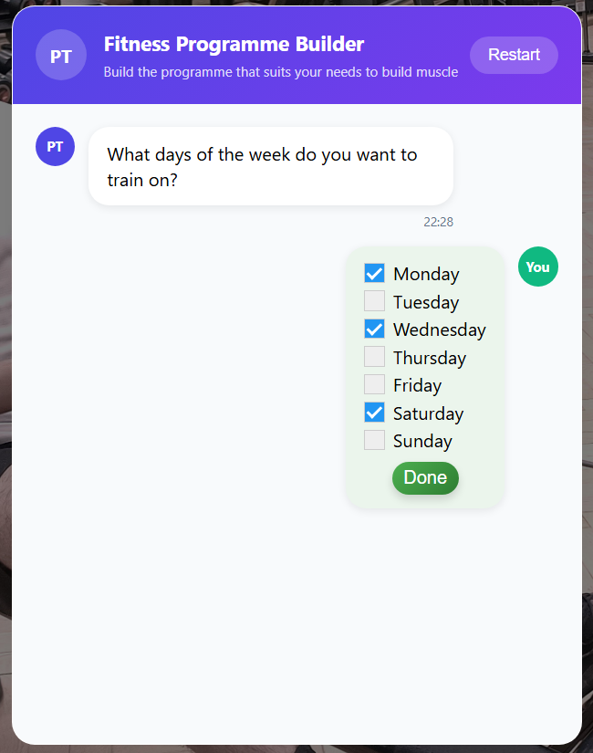
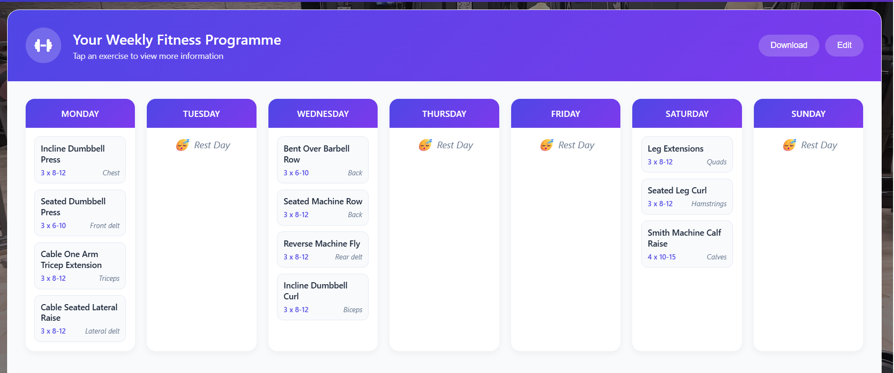

# Fitness Programme Builder Web App

A full-stack web application that generates **personalised fitness programmes** based on user preferences.  
The app combines a conversational chat-based interface, LLM-powered preference extraction, and a structured exercise database to produce a tailored training plan for the purpose of building muscle.

You can visit it [here](https://myfitnessprogrammebuilder.com).

---

## Features

### 🗨️ Chat-Based UI
- Interactive chat interface gathers user preferences.  
- Form widgets (checkboxes, radios) handle simple inputs such as:
  - Training days  
  - Time per session  
  - Available equipment  
  - Exercise variety
  - New to fitness

### 🤖 LLM Integration with Groq API
- Chat back and forth using **Llama 3.1 model**
- Then **Gemma model** processes chat history into **structured JSON** of:
  - Excluded muscle groups  
  - Preferred muscle groups  
- Strict JSON output ensures predictable downstream logic, and acts as the interface between frontend user input and backend programme generation

### 🏋️ Programme Generation Logic

#### 1. Determine training split (the muscle groups to be trained on each day):
- An optimal training split for each number of days is hardcoded:
  - 1 day: FULL BODY x1
  - 2 day: FULL BODY x2
  - 3 day: PUSH/PULL/LEGS
  - 4 day: UPPER/LOWER x2
  - 5 day: PUSH/PULL/LEGS/UPPER/LOWER
  - 6 day: PUSH/PULL/LEGS x ARNOLD (CHEST + BACK / ARMS / LEGS)
- Each day of the split is implemented as a priority list of muscle groups in order of those that are most important to train to least
- The corresponding split is then modified depending on the excluded and preferred muscle groups
- If major muscle groups are excluded, certain days of the split will be completely re-populated by prioritising muscle groups that have been tarined less and muscle groups that have not been trained in adjacent days
- Preferred muscle groups are selectively bumped up higher in the priority lists

#### 2. Obtain the exercises for each day according to the training split
- Exercises eligible for selection are loaded from **PostgreSQL** database into a Pandas DataFrame (so the query contains filters for equipment, beginner friendly, etc.)
- For each muscle group in the training split, the exercise DataFrame is filtered by primary muscle such that a subset of eligible exercises selected
- Out of this subset of exercises, the most suitable one is determined by calculating a **Suitability score** which is a function of the following:
  - **Hypertrophy score** (score judging how optimal the exercise is for building muscle)  
  - **Number of times used in the programme so far** (so that unused exercises are preferred)
- Suitability_score = hypertophy_score + **variability_multiplier** * no_of_uses (where the variability_multiplier's value is dependent on the user's preference for exercise variety)
- This exercise selection process is repeated until the current total time of the session exceeds the user's specified time_per_session
- The time to complete a given exercise is calculated as: no_of_sets * time_to_do_a_set_and_rest
- Once exercises have been selected for all days, a final check occurs to verify the safety and imbalance of the programme to ensure no muscle is being trained more than the recommended daily or weekly amount

#### 3. Exercises ordered in logical order for training
- For each day, exercises are re-ordered to follow a logical standard:
  - Compound / large muscle exercises first.  
  - Isolation / smaller muscle exercises later.  
- Programme returned as JSON → rendered by frontend as clean, modern **exercise cards**.

### 🎨 Frontend
- Built with **HTML, CSS, JavaScript**.  
- Key features:
  - Downloadable programme (download a pdf for screen sizes where programme can fit on one page and png otherwise)  
  - Exercise detail modals with images and instructions (query gets sent to database to get fields containing exercise details) 
  - Edit mode: add, swap, or delete exercises
  - When adding/swapping exercises, user can browse exercise database
  - Separate **exercises** page with filtering and search (muscle group, equipment, beginner-friendly) for users to browse exercises and their details
  - Separate **contact** page for user queries

### ⚙️ Backend & Infrastructure
- **AWS Lambda** (Python & Node.js) handles backend logic.  
- Invoked via **API Gateway** (POST/GET endpoints).  
- Data cleaned and normalised using **DBeaver** SQL client.  
- **Database**: originally Amazon RDS (PostgreSQL), recently migrated to **Supabase** due to lower costs  
- **Hosting**: AWS Amplify for the website.  
- Additional AWS services used:
  - IAM roles  
  - VPC security  
  - CloudShell  
  - S3 buckets (for Lambda uploads)  

---

## Tech Stack

- **Frontend**: HTML, CSS, JavaScript  
- **Backend**: AWS Lambda (Python + Node.js), API Gateway  
- **Database**: PostgreSQL (RDS → Supabase)  
- **Infra/Hosting**: AWS Amplify, IAM, VPC, S3  
- **AI**: Groq API (Gemma model + LLama 3.1)  

---

## Planned Improvements

- 🎥 **Video demonstrations of exercises**
  - Add new column to exercise table in the database for youtube video links to demonstrate exercise form

- 📊 **Track popular exercises**
  - Add new table to database meant for frequent updates, with a column for the number of times an exercise has been used in a downloaded/saved programme
  - Incorporate this data into the exercise generation algorithm so popular exercises are prioritised

- 🔒 **User accounts & authentication**  
  - Add the option to have account profiles allowing users to save, revisit, and update generated programmes.  

- 📈 **Progression tracking and visualisation**  
  - Track weight for different exercises, weight progress could be displayed in nice dashboard.

---

## Deployment

The application is currently deployed on **AWS Amplify**.  
Backend services run through **AWS Lambda + API Gateway**, connected to a **Supabase PostgreSQL** instance.

---

## License

This repository is made available for **personal and educational review only**.  
See [LICENSE.md](LICENSE.md) for details.
